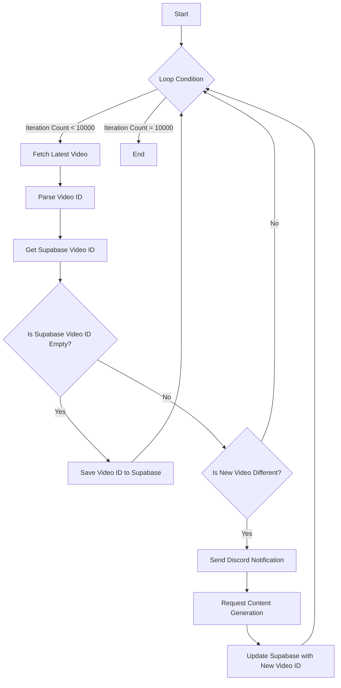

```mermaid
flowchart TD
    A[Start] --> B{Loop Condition}
    B -->|Iteration Count < 10000| C[Fetch Latest Video]
    C --> D[Parse Video ID]
    D --> E[Get Supabase Video ID]
    
    E --> F{Is Supabase Video ID Empty?}
    F -->|Yes| G[Save Video ID to Supabase]
    
    F -->|No| H{Is New Video Different?}
    H -->|Yes| I[Send Discord Notification]
    I --> J[Request Content Generation]
    J --> K[Update Supabase with New Video ID]
    
    H -->|No| B
    G --> B
    K --> B
    
    B -->|Iteration Count = 10000| L[End]
```